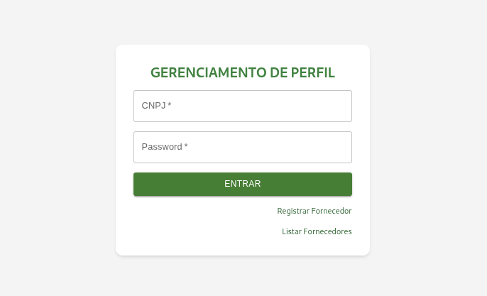
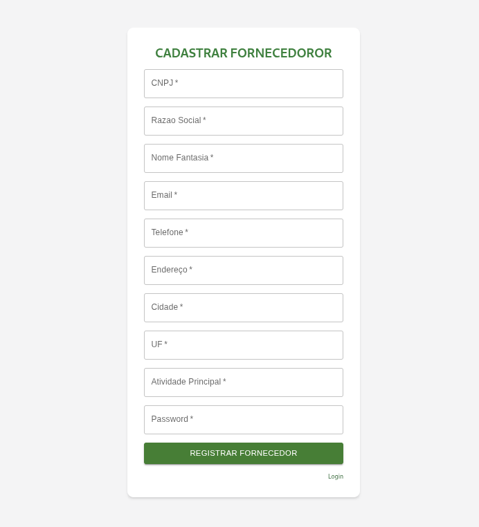
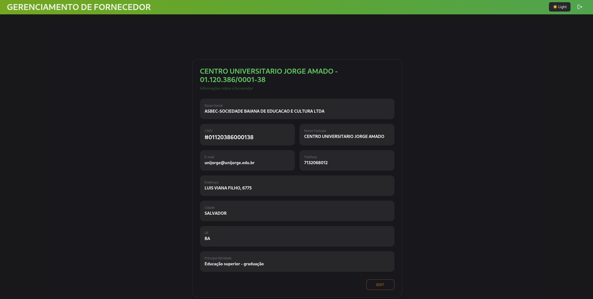
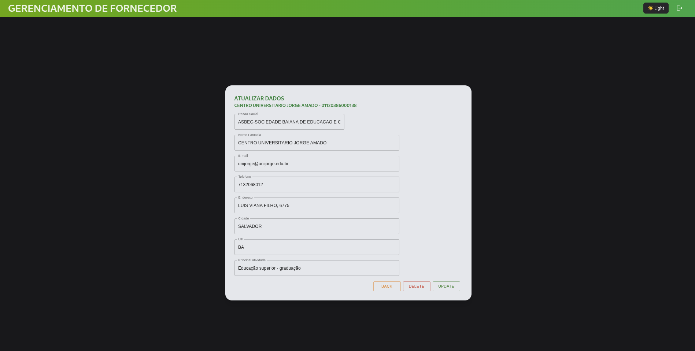
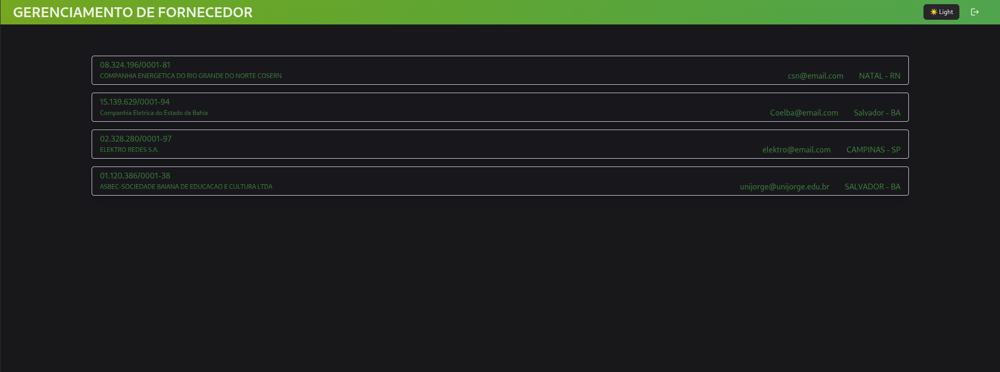

# Sistema de Cadastro de Fornecedores

Este projeto foi desenvolvido como parte de um teste técnico para implementação de um sistema de cadastro e manutenção de fornecedores.

A aplicação permite que fornecedores realizem seu próprio cadastro, façam login e gerenciem seus dados em uma área restrita.

## 📸 Telas do Sistema

### 🔐 Login

---

### 🧾 Cadastro de Fornecedor

---

### 🏠 Home

---

### ✏️ Edição de Fornecedor

---

### 📋 Listagem de Fornecedores

---

## 🚀 Tecnologias Utilizadas

### Backend
- .NET 7 / ASP.NET Core Web API
- Entity Framework Core
- PostgreSQL
- JWT Authentication

### Frontend
- React (JavaScript)
- Material UI (MUI)
- Fetch API
- React Router DOM

---

## 📌 Funcionalidades

### 🔓 Cadastro de Fornecedor (público)
- Cadastro aberto sem necessidade de autenticação
- Campos obrigatórios:
  - CNPJ
  - Razão Social
  - Nome Fantasia
  - E-mail
  - Telefone
  - Endereço
  - Cidade
  - UF
  - Atividade Principal
  - Senha

### 🔎 Autopreenchimento de CNPJ
- Integração com a API pública:
  - https://brasilapi.com.br/api/cnpj/v1/{cnpj}
- Ao informar o CNPJ, os dados são preenchidos automaticamente quando disponíveis

---

### 🔐 Login
- Autenticação via:
  - CNPJ
  - Senha
- Geração de token JWT
- Acesso restrito às funcionalidades do fornecedor

---

### 🧾 Área do Fornecedor (Restrita)
- Visualização dos dados cadastrados
- Atualização de informações cadastrais
- Logout

---

### 📋 Listagem Administrativa
- Listagem de fornecedores cadastrados
- Exibição de:
  - Razão Social
  - CNPJ
  - E-mail
  - Cidade
  - UF
  - Situação cadastral (quando disponível)

---

## ⚠️ Tratamento de Erros

A aplicação trata os seguintes cenários:

- CNPJ inválido
- CNPJ já cadastrado
- E-mail inválido
- Campos obrigatórios não preenchidos
- Senha obrigatória
- Falha na autenticação
- Erros de integração com API externa (BrasilAPI)
- Mensagens de sucesso em operações de cadastro e atualização

---

## 🗄️ Banco de Dados

O projeto utiliza PostgreSQL.

### Criação do Banco de Dados:
- CREATE DATABASE fornecedores;
- OBS (Sua string de conexão se encontra em ApiForncedores/appsettings.json(ConnectionStrings{DefaultConnection}))
- A criação das tabelas do banco serão feitas pelo Entity Framework Core

### Configuração padrão:

- Host: localhost
- Porta: 5432
- Database: fornecedores
- Usuário: postgres
- Senha: postgres

## 🔧 Como Executar o Projeto

BACKEND:
- cd ApiForncedores
- dotnet restore
- dotnet ef database update
- dotnet run

FRONTEND:
- cd FRONTEND
- npm install
- npm run dev

## 📈 Melhorias Futuras

- Mover string de conexão para variáveis de ambiente  
- Armazenar chave JWT em variáveis de ambiente  
- Implementar testes automatizados (unitários e integração)  
- Adicionar paginação na listagem de fornecedores   
- Implementar refresh token para autenticação  
- Dockerizar aplicação para facilitar deploy  
